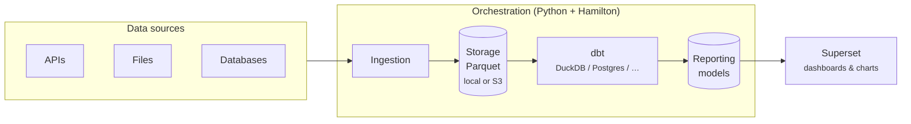
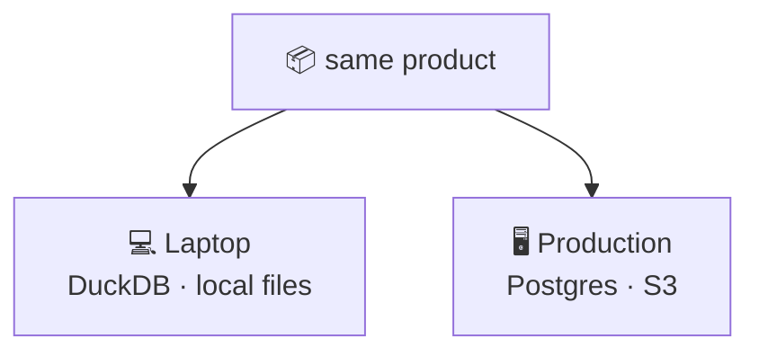
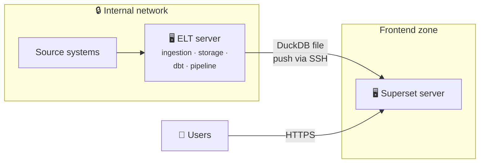
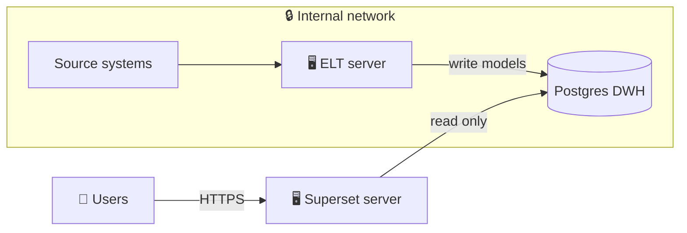
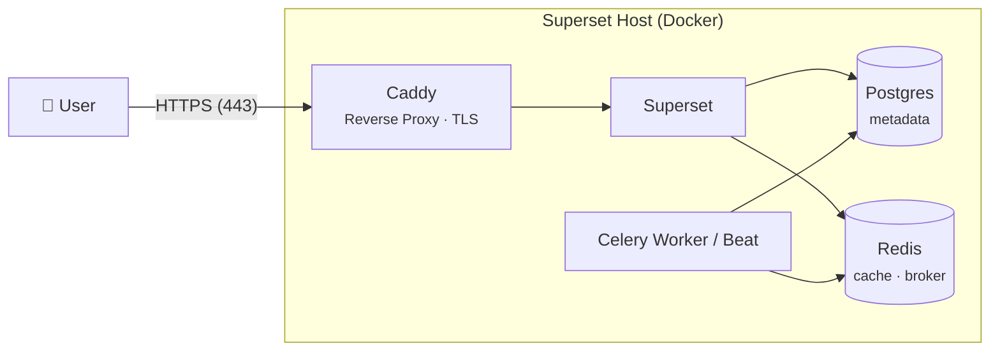

# Architecture

This page explains how the layers of a [coasti product](../coasti-products) work together at runtime — 
from raw source data to the dashboard a user opens in the browser.

## The data flow

Reading it left to right:

1. **Ingestion** fetches raw data from the sources the product defines and writes it as **Parquet files** — an open, columnar format that any engine can read.
2. **Storage** holds those files, either on the local filesystem or in an S3 bucket. Raw data stays raw: it is never modified, only re-read.
3. **dbt** transforms the raw data into clean reporting models. The product only defines *what* the transformations are; *where* they run (DuckDB, Postgres, …) is a deployment choice.
4. **Superset** connects to the resulting models and serves the product's dashboards to end users.

The **orchestration pipeline** — plain Python built on [Hamilton](https://github.com/dagworks-inc/hamilton) — wraps steps 1–3 into a single runnable unit, so refreshing a product is one command, not a sequence of manual steps.

## Design principles

**Open formats at every boundary.** Parquet between ingestion and transformation, SQL models via dbt, exported files for Superset content. There is no proprietary format anywhere in the chain — every layer can be inspected, replaced, or reused with standard tools.

**Engine-agnostic by separation.** Because raw data lives in Parquet and transformations live in dbt, the compute engine is swappable. The typical pattern: **DuckDB** for local development and small deployments, **Postgres** for production — same product, same models.

**Transformations as engineered software.** Using dbt is not just an engine choice — it brings software-engineering discipline to the transformation layer. Every model is SQL in Git, so there is a **full version history**: what changed, when, by whom, and it can be reviewed or rolled back like any code.

**Automated data tests** (uniqueness, not-null, referential integrity, custom checks) run with every pipeline execution, catching broken source data before it ever reaches a dashboard. And dbt generates **documentation and lineage** from the models themselves, so the path from raw column to dashboard KPI stays traceable as products grow.

**Deliberately boring orchestration.** No Airflow cluster, no scheduler infrastructure. A coasti pipeline is Python you can read, run, and debug directly. For products that refresh daily or weekly, this is a feature, not a limitation.

## One product, two environments

The product definition never changes between environments — only its configuration (answered via the installer's answer files) does.
This is what makes a product testable on a laptop and deployable at a customer without modification.

## Production topology: two hosts

In production, a coasti deployment typically runs on **two separate Docker hosts** — a deliberate separation of backend and frontend:

- The **ELT server** does all the work involving internal infrastructure: it fetches data from the source systems, stores it, and runs the dbt transformations via the orchestration pipeline.
- The **Superset server** does exactly one thing: serve dashboards to users. It never initiates connections into the internal network.

How the reporting data reaches the Superset server depends on the engine scenario.

### Scenario A: DuckDB (push via SSH)

The ELT server builds a finished DuckDB database and **pushes** it to the Superset server via SSH:

The security property this buys: **the Superset server has zero access to internal infrastructure.** It holds no credentials for source systems, no route into the internal network — it only *receives* a finished database. Even a fully compromised frontend host cannot reach anything behind it.

### Scenario B: Postgres DWH

If the customer runs Postgres as a data warehouse, the ELT server writes the reporting models into it and Superset reads from it:

Here the Superset server needs exactly **one** inbound path into the internal network — a read-only database connection to the DWH — and nothing else.

### Connection matrix

The complete set of allowed connections, usable as a firewall baseline:

| From | To | Protocol / Port | Purpose | Scenario |
|---|---|---|---|---|
| ELT server | Source systems | per source (HTTPS, DB ports, …) | Ingestion | both |
| ELT server | S3 | HTTPS (443) | Parquet storage (if S3 is used) | both |
| ELT server | Superset server | SSH (22) | Push built DuckDB file | DuckDB |
| ELT server | Postgres DWH | 5432 | Write reporting models | Postgres |
| Superset server | Postgres DWH | 5432 (read-only role) | Query reporting models | Postgres |
| Superset server | internal network | — none — | | DuckDB |
| Users | Superset server | HTTPS (443) | Dashboards | both |

The underlying principle: connections are **pushed from the backend outward**, never pulled from the frontend in. The only exceptions are user traffic to Superset and, in the Postgres scenario, the single read-only DWH connection. Concrete host setup, SSH key handling, and firewall configuration are covered in the Admin Guide.

### Inside the Superset Host

The Superset server is itself a small Docker stack (see [superset_docker](https://github.com/coasti-org/superset_docker)).
Exactly one container is reachable from the outside: **Caddy**, acting as a reverse proxy on ports 80/443.
Caddy terminates TLS — via Let's Encrypt (ACME), custom certificates, or self-signed — and forwards requests to Superset.

Everything else stays on the host's internal Docker network:

- **Caddy** is the only exposed container. TLS termination, HTTP→HTTPS redirects, and forwarding to Superset all happen here.
- **Superset** itself is not directly reachable — all access goes through Caddy.
- **Postgres (metadata)** stores Superset-internal objects only: users, dashboards, configuration. It is unrelated to the reporting-data DWH from Scenario B.
- **Redis** serves as cache and message broker for the **Celery worker and beat** containers, which handle asynchronous and scheduled tasks (e.g. reports, thumbnails).

## Next steps

- Dive into the data side: [Data layer: Ingestion, Storage & dbt](../data-layer)
- See how dashboards become code: [Frontend content (Superset)](../frontend-content)