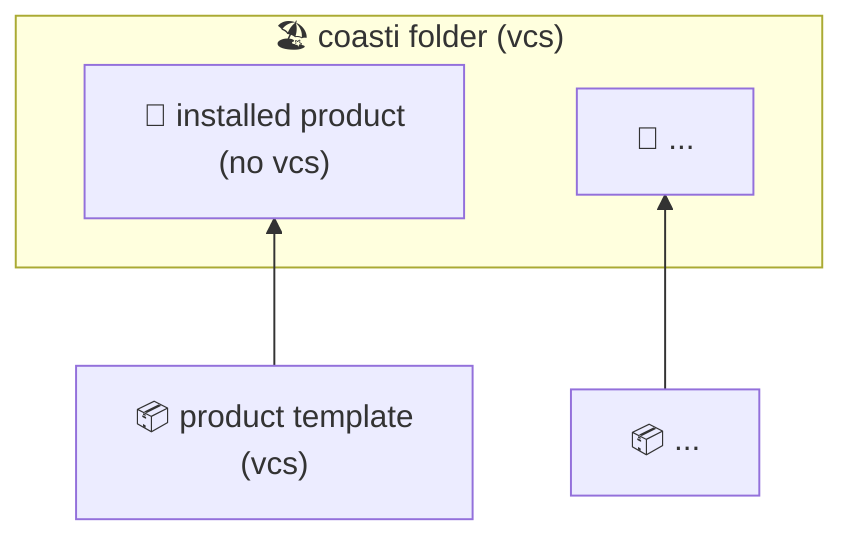

Think of coasti products as apps or content-packages, which you can install to get a new set of reports or functionality.

They are the building blocks of your coasti stack, living side-by side in your coasti folder.
For example, [superset](https://github.com/coasti-org/superset_docker) or our [demo content](https://github.com/linkFISH-Consulting/coasti_demo_content_statistics) are products.

## Key Information

- Products are self-contained code repositories 📦 that may contain multiple languages and tools.
- Products have versions and can be updated. The installation and update mechanism is based on [copier](https://copier.readthedocs.io/en/stable/) so that each product repo is also a copier _template_.
- Installed products 🚀 are not version controlled by themselves (no vcs).
- The version control is done on the level of your coasti folder 🏖.
- Use `coasti product add/install/update` and check the respective `coasti product --help` commands.

## Technical Details

During product installtion, coasti uses copier, which clones the remote template but does not include its git files in the deployed folder.
This has a few advantages:

- You can add customizations into each product, side-by-side to the original code. A good example are additional dbt models.
- Products can be updated, without breaking your customizations, while all upstream product changes still become part of your coasti version-control.
- Updates work exactly like they do for any copier template.

