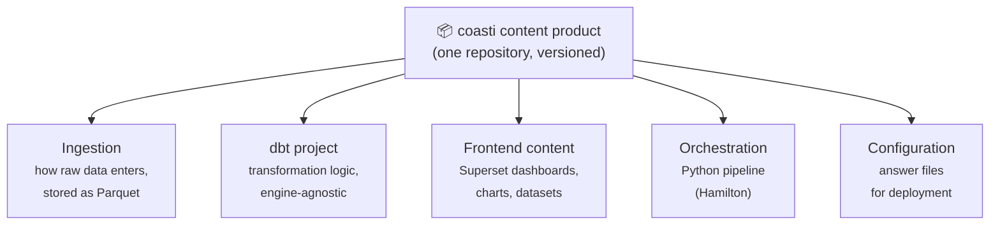
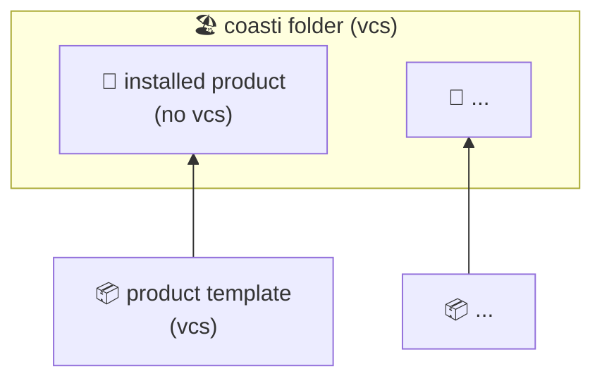

# coasti Products

Think of coasti products as **apps or content packages** which you can install to get a new set of reports or functionality.
They are the building blocks of your coasti stack, living side by side in your coasti folder.

For example, [superset](https://github.com/coasti-org/superset_docker) or our [demo content](https://github.com/linkFISH-Consulting/coasti_demo_content_statistics) are products.

## From projects to products

Classic BI work is organized as *projects*: a dashboard gets built for one team, the transformation logic lives in someone's repo, the ingestion script on a server.
The result works, but it is tied to one environment and one set of people.
Reusing it elsewhere means rebuilding it.

A coasti product turns the same work into a *deliverable*: one versioned unit that contains **everything** needed for its job.
Like a software package, it can be installed, updated, and shared — on a laptop, a server, or at a completely different organization.
And because a product is just a repository following the coasti structure, *anyone* can create and distribute one.

## What's inside a content product

A typical content product — one that delivers reports — bundles all layers from raw data to finished dashboard:

| Layer | Role |
|---|---|
| **Ingestion** | Defines how raw data is fetched and lands as Parquet files |
| **dbt project** | Transforms raw data into reporting models — runs on DuckDB, Postgres, or any dbt-supported engine |
| **Frontend content** | All Superset objects, exported as files and versioned like code |
| **Orchestration** | Ties the layers together into one runnable pipeline |
| **Configuration** | Answer files so the same product adapts to different environments |

Not every product is a content product, though — infrastructure components like the [Superset Docker stack](https://github.com/coasti-org/superset_docker) are packaged and installed as products too.
What all products share is the mechanism below.

## Products in your coasti stack

- Products are self-contained code repositories 📦 that may contain multiple languages and tools.
- Products have versions and can be updated. The installation and update mechanism is based on [copier](https://copier.readthedocs.io/en/stable/), so each product repo is also a copier *template*.
- Installed products 🚀 are not version controlled by themselves (no vcs).
- Version control happens on the level of your coasti folder 🏖 — one repository holding all your installed products side by side.
- Management is handled using `coasti product add/install/update`. Run `--help` on each command for details.

## Installation and updates with copier

During product installation, coasti uses copier, which clones the remote template but does not include its git files in the deployed folder.
This has a few advantages:

- **Customizations live side by side with the original code.** You can add your own additions into each installed product — a good example are additional dbt models.
- **Updates don't break your customizations.** A product update brings in all upstream changes while your local additions stay in place — and both become part of your coasti folder's version control.
- **Updates work exactly like they do for any copier template** — a well-established, documented mechanism rather than a custom invention.

This is what makes the product model practical in the long run: the same product installs identically everywhere, updates propagate from upstream, and each deployment can still adapt the product to its own needs without forking it.

## Next steps

- Understand how the layers of a content product interact at runtime: [Architecture](../architecture)
- Read a complete open-source product: [linkfish_genesis_stats](https://github.com/coasti-org/linkfish_genesis_stats)
- Try installing a product yourself: [Getting Started](../../getting-started/install-coasti-content)