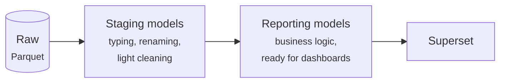

# Data layer: Ingestion, Storage & dbt

The data layer covers everything that happens before a dashboard: getting raw data in, keeping it safe, and shaping it into reporting models.

## Ingestion: raw data as Parquet

Every coasti product defines its own ingestion — the logic that fetches data from source systems (APIs, file downloads, databases) and lands it as **Parquet files**.

Two rules make this robust:

- **Raw means raw.** Ingested data is stored as-is. Cleaning, renaming, and business logic happen later, in dbt — never during ingestion. If a transformation turns out to be wrong, the raw data is still there and the models can simply be rebuilt.
- **Parquet as the contract.** Parquet is an open, compressed, columnar format that DuckDB, Postgres (via extensions), Spark, pandas, and virtually every modern tool can read. By standardizing on it, the ingestion side and the transformation side stay decoupled.

## Storage: local or S3

Parquet files need a home, and coasti supports two:

| | Local filesystem | S3 (or compatible) |
|---|---|---|
| **Typical use** | Development, laptops, small single-server setups | Production, shared environments |
| **Setup effort** | None | Bucket + credentials |
| **Backup / durability** | Your responsibility | Built into the object store |

The product itself doesn't care which one is used — storage is a configuration decision made at install time, not a property of the product.

## dbt: engine-agnostic transformations

All transformation logic lives in a standard **dbt project** inside the product: staging models on top of the raw Parquet data, then reporting models that Superset consumes.

Because dbt abstracts the SQL engine, the same models run on different backends:

- **DuckDB** — zero-infrastructure, reads Parquet natively, ideal for local development and smaller deployments.
- **Postgres** — the battle-tested choice for production, especially where a database already exists in the organization.
- **Anything else dbt supports** — the product format doesn't restrict the engine.

This is the practical meaning of *engine-agnostic*: switching from a laptop demo to a production deployment changes the dbt profile, not the product.

## Orchestration: one command to refresh

The steps above — ingest, store, transform — are wired together by a lightweight Python pipeline built on [Hamilton](https://github.com/dagworks-inc/hamilton).
Hamilton derives the execution order from plain Python functions, which keeps the pipeline declarative and debuggable without any scheduler infrastructure.
Refreshing a product's data is a single pipeline run.

## Next steps

- The counterpart to the data layer: [Frontend content (Superset)](../frontend-content)
- A real data layer to read: the ingestion and dbt project in [linkfish_genesis_stats](https://github.com/coasti-org/linkfish_genesis_stats)