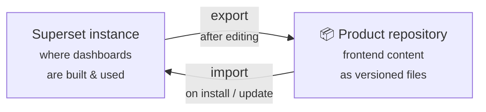

# Frontend content (Superset)

Dashboards are usually the part of BI that *cannot* be versioned: they live inside a tool's database, built by hand, impossible to diff or roll back. coasti treats them differently — **frontend content is code**.

## Dashboards as code

The frontend layer of a coasti product is the complete set of [Apache Superset](https://superset.apache.org/) objects the product ships:

- **Dashboards** — the pages end users open
- **Charts** — the individual visualizations
- **Datasets** — the mapping between charts and the dbt reporting models
- plus supporting objects like database connections (as templates)

All of these are exported as files and versioned in the product's Git repository, right next to the dbt models they depend on.
A change to a dashboard is a commit — reviewable, revertible, and shippable like any other change.

## superset_io: the bridge

The tool that makes this possible is [superset_io](https://github.com/coasti-org/superset_io). It moves frontend content in both directions:

The two directions correspond to the two roles around a product:

- **Product creators** build and refine dashboards in Superset's UI — the right tool for visual work — and then **export** the result into the repository.
- **Product users** never touch exports: the installer **imports** the frontend content into their Superset instance automatically, during installation and with every update.

## Why not just click it together?

Manually built dashboards work fine — until you need the second deployment. Then every chart has to be rebuilt by hand, and the copies drift apart with every future change. With frontend content as code:

- **One definition, many instances.** The same dashboards install identically at every customer.
- **Updates propagate.** Improve a dashboard once, ship it as a product update everywhere.
- **History exists.** Git log answers "what changed in this dashboard and when" — a question Superset alone cannot answer.

## The Superset stack around it

Two more repositories support the frontend layer: [superset_docker](https://github.com/coasti-org/superset_docker) provides Superset as a production-ready Docker stack, and [superset_lucide_extension](https://github.com/coasti-org/superset_lucide_extension) adds Lucide icons (soon included in the Docker image by default).
How to run them is covered in the Admin Guide — conceptually, all you need to know is: any Superset instance a product is installed into receives the product's frontend content via superset_io.

## Next steps

- Back to the big picture: [Architecture](./architecture.mdx)
- Build your own dashboards and export them: [Creating content](/getting-started/create-content)