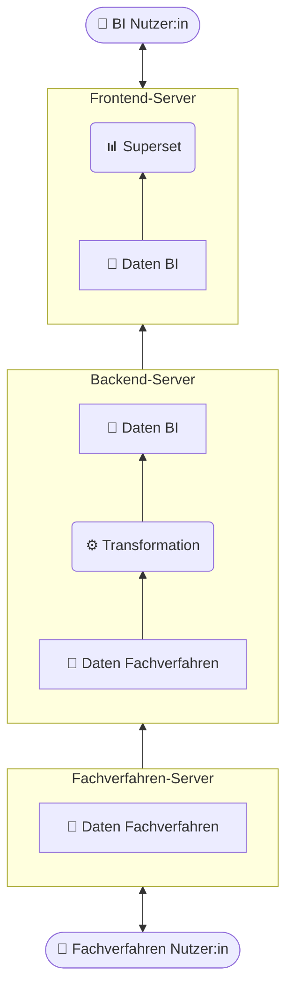

# Technische Anforderungen

## Übersicht

<div class="diagram caption-right caption-width-80" markdown="block">
<div class="diagram-chart">

</div>
<div class="diagram-caption" markdown="block">

**Abbildung 1: Übersicht der Datenflüsse.**

In einem typischen coasti Content-Paket fließen Daten durch drei Server (beginnend unten in der Abbildung):

- _Fachverfahren-Server_ (enthält die Rohdaten des Quellsystems)
- _Backend-Server_ (transformiert Daten in die BI-Darstellung)
- _Frontend-Server_ (stellt BI-Daten für Endanwender:innen bereit)

Diese Trennung erfolgt bewusst, und hat einige Vorteile:

- Der für den operativen Betrieb benötigte Fachverfahren-Server bleibt von der BI-Lösung weitestgehend unberührt. Benötigte Daten werden während der _Ingestion_ kopiert.
- So finden alle rechenintensiven Transformationen ausschließlich auf dem Backend-Server statt.
- Das schont sowohl den Fachverfahren-Server, als auch den Frontend-Server.
  Beide sind relevant für das Nutzungserlebnis der Endanwender:innen.
- Daten sind isoliert: der Frontend-Server hat nur Zugriff auf seine Kopie der BI-Daten.
  Der Backend-Server erzeugt die BI-Daten, und übergibt sie an den Frontend-Server, hat aber selbst nur Zugriff auf seine eigene eingeschränkte Kopie der Rohdaten des Fachverfahrens.
  Die Datenströme zwischen den Servern sind gerichtet und beschränkt, so kann der Frontend-Server z.b. weder eigenständig eine neue Kopie vom Backend-Server laden, noch auf den Fachverfahren-Server zugreifen.

</div>
</div>

## Hardware Mindestanforderungen

Für _Apache Superset_ und die Extract-Transform-Load (ETL) Berechnungen auf dem Backend-Server werden Docker Container verwendet.
Im minimalen Setup werden zumindest zwei Linux-Hosts benötigt.
Dies bietet unter anderem folgende Vorteile:
- Container-Umgebungen können gut skaliert, geupdated und migirert werden.
- Linux-Hosts entsprechen dem Open-Source Prinzipien von coasti und vermeiden Lizenzkosten.
- Die benötigte Docker-Runtime funktioniert unter Linux sehr robust, auf anderen Plattformen müsste zusätzlich emuliert werden.


|                 |  Backend-Server                | Frontend-Server Superset       |
|-----------------|--------------------------------|--------------------------------|
| Betriebssystem  | Ubuntu 24.04 LTS               | Ubuntu 24.04 LTS               |
| Prozessorkerne  | 4                              | 4                              |
| Arbeitsspeicher | 16 GB                          | 16 GB                          |
| Speicherplatz   | 150 GB                         | 50 GB                          |


## Datenabruf vom Quellsystem

Für das Bereitstellen von Daten aus den Fachverfahren wird meist ein Lesezugriff auf die Quelltabellen benötigt.
Die Quelltabellen liegen üblicherweise in Datenbanken wie Progress, Oracle, oder MSSQL.

Unter Nutzung der erstellten Zugänge werden nächtlich alle benötigten Daten von _LÄMMkom Analyse_ abgerufen.
Read-only Berechtigungen sind ausreichend, es werden keine Daten auf dme Fachverfahren-Server bearbeitet.

### Progress als Quelldatenbank

Der Datenabruf von Progress erfolgt häufig via ODBC.
Dazu muss ein SQL-Broker bereitgestellt werden, was gegebenefalls mit den Herstellenden der Fachverfahren koordiniert werden muss.


### Oracle als Quelldatenbank

Bei Nutzung von Oracle als Quellsystem ist eine Benutzer:in mit Leserechten erforderlich.

Mit nachfolgendem Befehl lässt sich eine solche „ReadOnly“-Benutzer:in anlegen.
Der Zugriff lässt sich aber auch auf einzelne benötigte Tabellen limitieren.

```sql
CREATE USER ro_coasti
    IDENTIFIED BY ~sichereskennwort~
    DEFAULT TABLESPACE users
    TEMPORARY TABLESPACE temp;

GRANT CREATE SESSION to ro_coasti
    CREATE ROLE ro_Fachverfahren;

BEGIN
    FOR x IN (SELECT * FROM dba_tables WHERE owner='pub') LOOP
        EXECUTE IMMEDIATE 'GRANT SELECT ON pub.' || x.table_name || ' TO ro_Fachverfahren';
    END LOOP;
END;

GRANT ro_Fachverfahren TO ro_coasti;

```

## Netzwerk-Verbindungen


- Zugriff auf Quelldaten: Zum nächtlichen Datenabruf wird der Zugriff auf den Fachverfahren-Server benötigt.
    Die Port- und Netzwerk-Freigaben sind von der Datenbank abhängig. In der Regel:
    - Vom Backend-Server zum Fachverfahren-Server
    - MSSQL: `1433 TCP`
    - Progress: `14011 TCP`
    - Oracle: `1521 TCP`
- Zum Übertragen der aufbreiteten BI-Daten wird eine SSH/rsync Verbindung benötigt:
    - Vom Backend-Server zum Frontend-Server
    - SSH: `22 TCP`
- Für das Reporting der Nachtläufe per Email werden entsprechende Zugang benötigt:
    - Vom Backend-Server zum on-prem Mail-Server
    - Port abhängig von lokaler Konfiguration, üblich sind `25, 465, 587`
- Für den Zugriff der Endanwender:innen auf die BI-Dashboards muss der Frontend-Server erreichbar sein:
    - Von LAN zu Frontend-Server
    - HTTP: `80 TCP/UDP`
    - HTTPS: `443 TCP/UDP`
- Für die Erreichbarkeit des Frontend-Servers werden eine Domain-Weiterleitung sowie SSL-Zertifikate benötigt.
    - Weiterleitung der gewünschten Domain, innerhalb des LAN zu Frontend-Server. Typischerweise `https://coasti.example.de`
    - Mit on-prem CA signiertes SSL-Zertifkat (`fullchain.pem`, `private_key.pem`)
- Während der Installation oder Wartung:
    - Für den Zeitraum der Installation von coasti und Content-Paketen wird eine Internetverbindung benötigt, um Quellpakete zu laden.
      Nach abgschlossener Installation funktionieren alle Systeme offline.
        - Uplink von Backend-Server und Frontend-Server
    - Wartungs-Zugriff
        - Wenn die Installation von Drittanbietern erfolgt, wird Zugriff ins Intranet durch einen Jump-Host benötigt. Dieser kann entweder per VPN oder Remote-Control Lösungen wie TeamViewer bereitgestellt werden.
        - Vom Jump-Host aus werden dann Zugriffe auf Backend- und Frontend-Server benötigt.
            - SSH: `22 TCP`
            - HTTP: `80 TCP/UDP`
            - HTTP: `8088 TCP/UDP`
            - HTTPS: `443 TCP/UDP`
