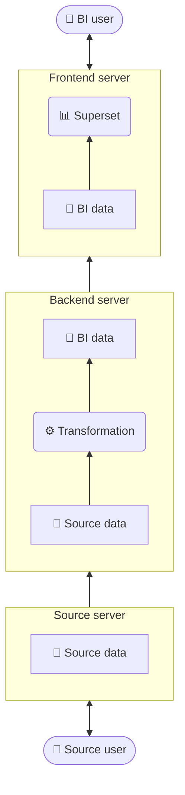

# Requirements

## Overview

<figure class="figcaption-right">


<figcaption>

**Figure 1: Overview of data flows.**

In a typical coasti content package, data flows through three servers (starting at the bottom of the figure):

- _Source server_ (contains the raw data from the source system)
- _Backend server_ (transforms data into the BI representation)
- _Frontend server_ (makes BI data available to end users)

This separation is intentional and has several advantages:

- The source server required for operational use remains largely unaffected by the BI solution. Required data is copied during _ingestion_.
- This ensures that all computationally intensive transformations take place exclusively on the backend server.
- This reduces the load on both the source server and the frontend server.
    Both are relevant to the end-user experience.
- Data is isolated: the frontend server only has access to its copy of the BI data.
    The backend server generates the BI data and transfers it to the frontend server, but itself only has access to its own restricted copy of the source's raw data.
    The data flows between the servers are directional and restricted. This means, for example, that the frontend server can neither independently download a new copy from the backend server nor access the source server.

</figcaption>

</figure>

## Minimum Hardware Requirements

Docker containers are used for _Apache Superset_ and the Extract-Transform-Load (ETL) computations on the backend server.
The minimum setup requires at least two Linux hosts.
Among other things, this offers the following advantages:
- Container environments can be scaled, updated, and migrated easily.
- Linux hosts are consistent with coasti's open-source principles and avoid licensing costs.
- The required Docker runtime works very reliably on Linux; on other platforms, additional emulation would be required.


|                 |  Backend-Server                | Frontend-Server Superset       |
|-----------------|--------------------------------|--------------------------------|
| Operating system | Ubuntu 24.04 LTS               | Ubuntu 24.04 LTS               |
| CPU cores        | 4                              | 4                              |
| RAM              | 16 GB                          | 16 GB                          |
| Storage          | 150 GB                         | 50 GB                          |


## Data Retrieval from the Source System

Providing data from the source usually requires read access to the source tables.
The source tables are typically located in databases such as Progress, Oracle, or MSSQL.

Using the created credentials, _LÄMMkom Analyse_ retrieves all required data nightly.
Read-only permissions are sufficient; no data is modified on the source server.

### Progress as the Source Database

Data is often retrieved from Progress via ODBC.
For this purpose, an SQL broker must be provided, which may need to be coordinated with the source system's vendors.


### Oracle as the Source Database

When Oracle is used as the source system, a user with read permissions is required.

The following command can be used to create such a read-only user.
Access can also be restricted to individual required tables.

```sql
CREATE USER ro_coasti
    IDENTIFIED BY ~sichereskennwort~
    DEFAULT TABLESPACE users
    TEMPORARY TABLESPACE temp;

GRANT CREATE SESSION to ro_coasti
    CREATE ROLE ro_Source;

BEGIN
    FOR x IN (SELECT * FROM dba_tables WHERE owner='pub') LOOP
        EXECUTE IMMEDIATE 'GRANT SELECT ON pub.' || x.table_name || ' TO ro_Source';
    END LOOP;
END;

GRANT ro_Source TO ro_coasti;

```

## Network Connections


- Access to source data: Access to the source server is required for nightly data retrieval.
    The required ports and network rules depend on the database. Typically:
    - From the backend server to the source server
    - MSSQL: `1433 TCP`
    - Progress: `14011 TCP`
    - Oracle: `1521 TCP`
- An SSH/rsync connection is required to transfer the prepared BI data:
    - From the backend server to the frontend server
    - SSH: `22 TCP`
- Appropriate access is required to report nightly runs by email:
    - From the backend server to the on-premises mail server
    - Port depends on the local configuration; common ports are `25, 465, 587`
- The frontend server must be reachable so that end users can access the BI dashboards:
    - From the LAN to the frontend server
    - HTTP: `80 TCP/UDP`
    - HTTPS: `443 TCP/UDP`
- A domain redirect and SSL certificates are required to make the frontend server accessible.
    - Redirect the desired domain to the frontend server within the LAN. Typically: `https://coasti.example.de`
    - An SSL certificate signed by an on-premises CA (`fullchain.pem`, `private_key.pem`)
- During installation or maintenance:
    - An internet connection is required during the installation of coasti and content packages to download source packages.
      After installation is complete, all systems function offline.
        - Uplink from the backend and frontend servers
    - Maintenance access
        - If installation is performed by a third party, intranet access via a jump host is required. This can be provided either via VPN or remote-control solutions such as TeamViewer.
        - Access to the backend and frontend servers is then required from the jump host.
            - SSH: `22 TCP`
            - HTTP: `80 TCP/UDP`
            - HTTP: `8088 TCP/UDP`
            - HTTPS: `443 TCP/UDP`
