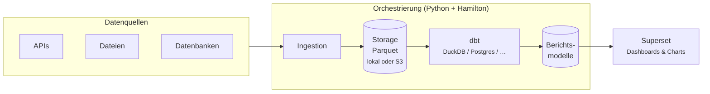
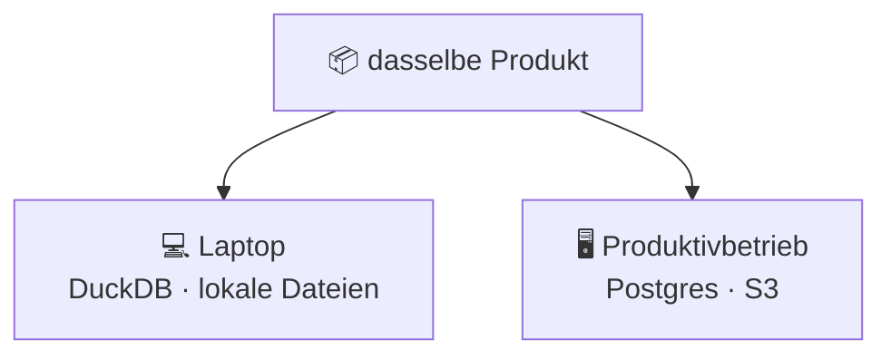
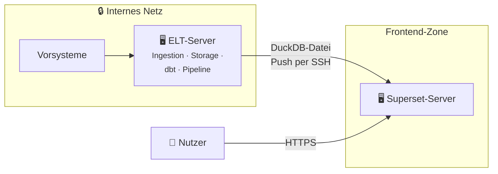
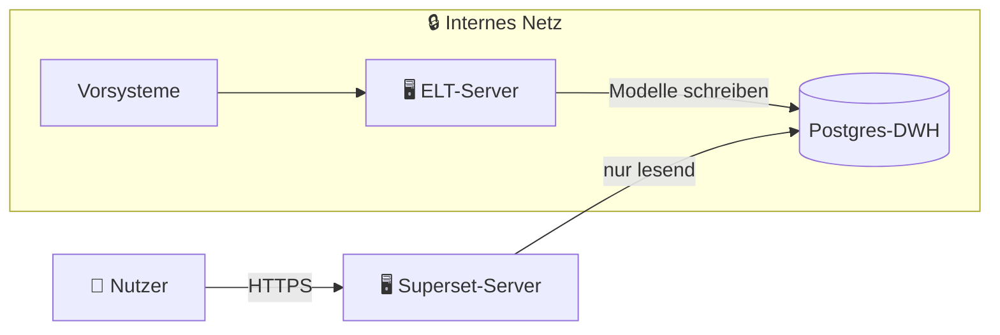
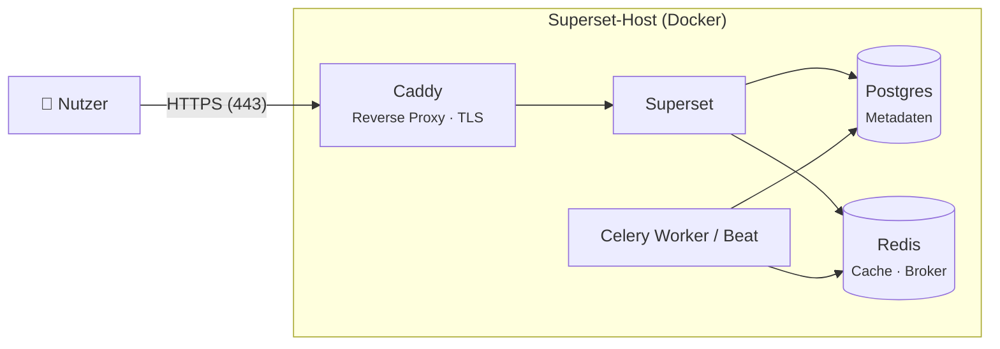

# Architektur

Diese Seite erklärt, wie die Layer eines [coasti-Produkts](../coasti-products) zur Laufzeit zusammenspielen — von den Rohdaten bis zum Dashboard, das ein Nutzer im Browser öffnet.

## Datenfluss

Von links nach rechts gelesen:

1. **Ingestion** holt Rohdaten aus den Quellen, die das Produkt definiert, und schreibt sie als **Parquet-Dateien** — ein offenes, spaltenorientiertes Format, das praktisch jede Engine lesen kann.
2. **Storage** hält diese Dateien vor, entweder im lokalen Dateisystem oder in einem S3-Bucket. Rohdaten bleiben roh: Sie werden nie verändert, nur neu gelesen.
3. **dbt** transformiert die Rohdaten in saubere Berichtsmodelle. Das Produkt definiert nur, *was* transformiert wird; *wo* die Transformationen laufen (DuckDB, Postgres, …), ist eine Deployment-Entscheidung.
4. **Superset** verbindet sich mit den fertigen Modellen und stellt den Endnutzern die Dashboards des Produkts bereit.

Die **Orchestrierungs-Pipeline** — schlichtes Python auf Basis von [Hamilton](https://github.com/dagworks-inc/hamilton) — fasst die Schritte 1–3 zu einer lauffähigen Einheit zusammen. Ein Produkt zu aktualisieren ist damit ein Befehl, keine Abfolge manueller Schritte.

## Designprinzipien

**Offene Formate an jeder Schnittstelle.** Parquet zwischen Ingestion und Transformation, SQL-Modelle via dbt, exportierte Dateien für Superset-Inhalte. Nirgends in der Kette steckt ein proprietäres Format — jedes Layer lässt sich mit Standardwerkzeugen inspizieren, ersetzen oder weiterverwenden.

**Engine-agnostisch durch klare Trennung.** Weil Rohdaten in Parquet und Transformationen in dbt liegen, ist die Compute-Engine austauschbar. Das typische Muster: **DuckDB** für lokale Entwicklung und kleine Deployments, **Postgres** für den Produktivbetrieb — gleiches Produkt, gleiche Modelle.

**Transformationen als Software-Handwerk.** Die Wahl von dbt ist nicht nur eine Engine-Frage — es bringt Software-Engineering-Disziplin in die Transformations-Layer. Jedes Modell ist SQL in Git, es gibt also eine vollständige Versionshistorie: wer wann was geändert hat, nachvollziehbar und umkehrbar wie jeder Code.

**Automatisierte Datentests** (Eindeutigkeit, Not-Null, referenzielle Integrität, eigene Prüfungen) laufen bei jeder Pipeline-Ausführung mit und fangen kaputte Quelldaten ab, bevor sie je ein Dashboard erreichen. Und dbt generiert **Dokumentation und Lineage** direkt aus den Modellen — der Weg von der Rohspalte bis zur Dashboard-Kennzahl bleibt auch bei wachsenden Produkten nachvollziehbar.

**Bewusst unspektakuläre Orchestrierung.** Kein Airflow-Cluster, keine Scheduler-Infrastruktur. Eine coasti-Pipeline ist Python, das man direkt lesen, ausführen und debuggen kann. Für Produkte mit täglicher oder wöchentlicher Aktualisierung ist das ein Feature, keine Einschränkung.

## Ein Produkt, zwei Umgebungen

Die Produktdefinition ändert sich zwischen Umgebungen nie — nur die Konfiguration, gesetzt über die Antwortdateien des Installers.
Genau deshalb lässt sich ein Produkt auf dem Laptop testen und beim Kunden ohne Anpassung deployen.

## Topologie im Produktivbetrieb: zwei Hosts

Im Produktivbetrieb läuft ein coasti-Deployment typischerweise auf **zwei getrennten Docker-Hosts** — eine bewusste Trennung von Backend und Frontend:

- Der **ELT-Server** erledigt alles, was interne Infrastruktur berührt: Holt Daten aus den Vorsystemen, legt sie ab und führt die dbt-Transformationen über die Orchestrierungs-Pipeline aus.
- Der **Superset-Server** tut genau eine Sache: Dashboards an Nutzer ausliefern. Er initiiert nie Verbindungen ins interne Netz.

Wie die Berichtsdaten zum Superset-Server gelangen, hängt vom Engine-Szenario ab.

### Szenario A: DuckDB (Push per SSH)

Der ELT-Server baut eine fertige DuckDB-Datenbank und **pusht** sie per SSH auf den Superset-Server:

Die Sicherheitseigenschaft, die man damit gewinnt: **Der Superset-Server hat keinerlei Zugriff auf interne Infrastruktur.**
Er besitzt keine Zugangsdaten zu Vorsystemen, keine Route ins interne Netz — er *empfängt* nur eine fertige Datenbank.
Selbst ein vollständig kompromittierter Frontend-Host erreicht nichts im internen Netz.

### Szenario B: Postgres-DWH

Betreibt der Kunde Postgres als Data Warehouse, schreibt der ELT-Server die Berichtsmodelle dort hinein und Superset liest daraus:

Hier braucht der Superset-Server genau **einen** eingehenden Pfad ins interne Netz — eine lesende Datenbankverbindung zum DWH — und sonst nichts.

### Verbindungsmatrix

Alle erlaubten Verbindungen im Überblick:

| Von | Nach | Protokoll / Port | Zweck | Szenario |
|---|---|---|---|---|
| ELT-Server | Vorsysteme | je Quelle (HTTPS, DB-Ports, …) | Ingestion | beide |
| ELT-Server | S3 | HTTPS (443) | Parquet-Storage (falls S3 genutzt wird) | beide |
| ELT-Server | Superset-Server | SSH (22) | Fertige DuckDB-Datei pushen | DuckDB |
| ELT-Server | Postgres-DWH | 5432 | Berichtsmodelle schreiben | Postgres |
| Superset-Server | Postgres-DWH | 5432 (Read-only-Rolle) | Berichtsmodelle abfragen | Postgres |
| Nutzer | Superset-Server | HTTPS (443) | Dashboards | beide |
| **Superset-Server** | **internes Netz** | **— keine —** | | DuckDB |

Das Prinzip dahinter: Verbindungen werden **vom Backend nach außen gepusht**, nie vom Frontend nach innen gezogen.
Die einzigen Ausnahmen sind der Nutzerverkehr zu Superset und — im Postgres-Szenario — die eine lesende DWH-Verbindung. Konkretes Host-Setup, SSH-Key-Handling und Firewall-Konfiguration beschreibt der Admin Guide.

### Innerhalb des Superset-Hosts

Der Superset-Server ist selbst ein kleiner Docker-Stack (siehe [superset_docker](https://github.com/coasti-org/superset_docker)). Von außen erreichbar ist davon genau ein Container: **Caddy** als Reverse Proxy auf den Ports 80/443. Caddy terminiert TLS — wahlweise per Let's Encrypt (ACME), mit eigenen Zertifikaten oder self-signed — und reicht Anfragen an Superset weiter.

Alles andere bleibt im internen Docker-Netz des Hosts:

- **Caddy** ist der einzige exponierte Container. TLS-Terminierung, HTTP→HTTPS-Redirect und Weiterleitung an Superset passieren hier.
- **Superset** selbst ist nicht direkt erreichbar — der Zugriff läuft ausschließlich über Caddy.
- **Postgres (Metadaten)** speichert nur Superset-interne Objekte: Nutzer, Dashboards, Konfiguration. Er hat nichts mit dem Berichtsdaten-DWH aus Szenario B zu tun.
- **Redis** dient als Cache und Message Broker für **Celery Worker und Beat**, die asynchrone und geplante Aufgaben (z. B. Berichte, Thumbnails) übernehmen.

## Nächste Schritte

- Mehr zum Data Layer: [Data Layer: Ingestion, Storage & dbt](../data-layer)
- Wie Dashboards zu Code werden: [Frontend-Inhalte (Superset)](../frontend-content)