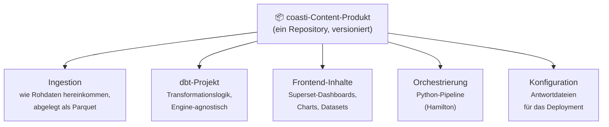
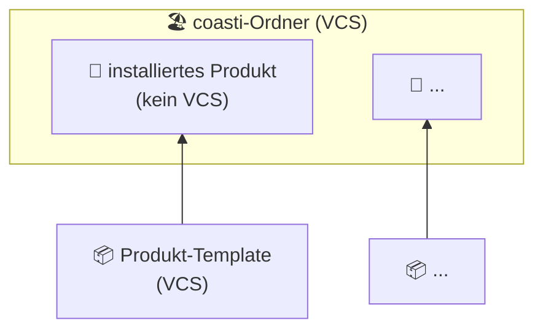

# Das coasti-Produkte

coasti-Produkte sind vergleichbar mit **Apps oder Content-Paketen**, die für zusätzliche Berichte oder Funktionen installiert werden.
Als zentrale Bausteine des coasti-Stacks werden sie gemeinsam im selben coasti-Ordner abgelegt.

Beispiele: [superset](https://github.com/coasti-org/superset_docker) oder unser [Demo-Content](https://github.com/linkFISH-Consulting/coasti_demo_content_statistics) sind Produkte.

## Vom Projekt zum Produkt

Klassische BI-Arbeit ist als *Projekt* organisiert: Ein Dashboard wird für ein Team gebaut, die Transformationslogik liegt in irgendeinem Repo, das Ingestion-Skript auf einem Server. Das Ergebnis funktioniert — aber es hängt an einer Umgebung und an bestimmten Personen. Es woanders wiederzuverwenden heißt meist: neu bauen.

Ein coasti-Produkt macht aus derselben Arbeit ein *Deliverable*: eine versionierte Einheit, die **alles** enthält, was für ihre Aufgabe nötig ist. Wie ein Software-Paket lässt es sich installieren, aktualisieren und weitergeben — auf dem Laptop, auf einem Server oder in einer ganz anderen Organisation. Und weil ein Produkt nur ein Repository nach coasti-Struktur ist, kann *jeder* eines erstellen und verteilen.

## Was in einem Content-Produkt steckt

Ein typisches Content-Produkt — eines, das Berichte liefert — bündelt alle Ebenen von den Rohdaten bis zum fertigen Dashboard:

| Layer | Rolle |
|---|---|
| **Ingestion** | Definiert, wie Rohdaten abgeholt und als Parquet-Dateien abgelegt werden |
| **dbt-Projekt** | Transformiert Rohdaten in Berichtsmodelle — läuft auf DuckDB, Postgres oder jeder von dbt unterstützten Engine |
| **Frontend-Inhalte** | Alle Superset-Objekte, als Dateien exportiert und wie Code versioniert |
| **Orchestrierung** | Verbindet die Layer zu einer lauffähigen Pipeline |
| **Konfiguration** | Antwortdateien, damit sich dasselbe Produkt an verschiedene Umgebungen anpassen lässt |

Nicht jedes Produkt ist ein Content-Produkt: Auch Infrastruktur-Komponenten wie der [Superset-Docker-Stack](https://github.com/coasti-org/superset_docker) werden als Produkte paketiert und installiert.
Allen Produkten gemeinsam ist der nachfolgende Mechanismus.

## Produkte im coasti-Stack

- Produkte sind eigenständige Code-Repositories 📦, die mehrere Sprachen und Werkzeuge enthalten können.
- Produkte haben Versionen und können aktualisiert werden. Der Installations- und Update-Mechanismus basiert auf [copier](https://copier.readthedocs.io/en/stable/) — jedes Produkt-Repo ist damit zugleich ein copier-*Template*.
- Installierte Produkte 🚀 stehen nicht unter Versionskontrolle (kein VCS).
- Die Versionskontrolle erfolgt auf Ebene des coasti-Ordners 🏖 — ein Repository, das alle installierten Produkte enthält.
- Die Verwaltung erfolgt mithilfe von `coasti product add/install/update`. Details liefert `--help` beim jeweiligen Befehl.

## Installation und Updates mit copier

Bei der Produkt-Installation nutzt coasti copier: Das Remote-Template wird geklont, seine Git-Dateien landen aber nicht im deployten Ordner. Das hat einige Vorteile:

- **Original-Code und Anpassungen existieren parallel**: In jedem installierten Produkt lassen sich problemlos eigene Ergänzungen vornehmen – ein gutes Beispiel hierfür sind zusätzliche dbt-Modelle.
- **Updatesichere Änderungen**: Ein Produkt-Update integriert alle Upstream-Neuerungen, während lokale Ergänzungen unangetastet bleiben. Beides wird anschließend sauber in der Versionskontrolle des coasti-Ordners erfasst.
- **Bewährter Standard**: Updates funktionieren exakt wie bei jedem herkömmlichen copier-Template. Dadurch kommt ein etablierter, gut dokumentierter Mechanismus zum Einsatz anstelle einer fehleranfälligen Eigenentwicklung.

Genau das macht das Produktmodell langfristig so praktikabel: Ein Produkt wird überall identisch installiert, Upstream-Updates lassen sich nahtlos einspielen, und dennoch kann das Produkt in jedem Deployment an die eigenen Bedürfnisse angepasst werden – ganz ohne Fork.

## Nächste Schritte

- Wie die Layer eines Content-Produkts zur Laufzeit zusammenspielen: [Architektur](../architecture)
- Ein vollständiges Open-Source-Produkt zum Nachlesen: [linkfish_genesis_stats](https://github.com/coasti-org/linkfish_genesis_stats)
- Selbst ein Produkt installieren: [Getting Started](../../getting-started/install-coasti-content)