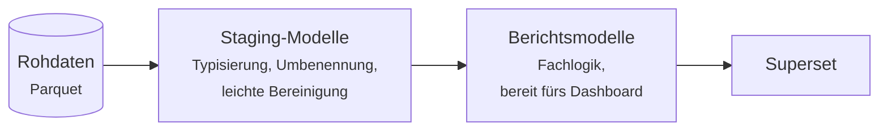

# Data Layer: Ingestion, Storage & dbt

Der Data Layer umfasst alle Schritte, die vor der Visualisierung im Dashboard stattfinden: Rohdaten extrahieren, sicher speichern und in Berichtsmodellen aufbereiten.

## Ingestion: Rohdaten als Parquet

Jedes coasti-Produkt definiert seine eigene Ingestion — also die Logik, um Daten aus Quellsystemen (wie APIs, Datei-Downloads oder Datenbanken) zu extrahieren und als **Parquet-Dateien** zu speichern.

Zwei Grundregeln sorgen dabei für Robustheit:

- **Rohdaten bleiben roh.** Eingelesene Daten werden strikt unverändert gespeichert. Bereinigung, Umbenennung und das Anwenden von Fachlogik erfolgen erst später in dbt — niemals während der Ingestion. Stellt sich eine Transformation im Nachhinein als fehlerhaft heraus, bleiben die originalen Rohdaten unangetastet und die Modelle können jederzeit neu berechnet werden.
- **Parquet als verbindliches Format.** Parquet ist ein offenes, komprimiertes, spaltenorientiertes Format, das DuckDB, Postgres (per Extension), Spark, pandas und praktisch jedes moderne Werkzeug lesen kann. Durch diese Standardisierung bleiben Ingestion- und Transformationsseite entkoppelt.

## Storage: lokal oder S3

Parquet-Dateien brauchen ein Zuhause, und coasti unterstützt zwei:

| | Lokales Dateisystem | S3 (oder kompatibel) |
|---|---|---|
| **Typischer Einsatz** | Entwicklung, Laptops, kleine Single-Server-Setups | Produktivbetrieb, geteilte Umgebungen |
| **Einrichtungsaufwand** | Keiner | Bucket + Zugangsdaten |
| **Backup / Ausfallsicherheit** | Eigene Verantwortung | Im Object Store eingebaut |

Dem Produkt selbst ist egal, welche Variante genutzt wird — Storage ist eine Konfigurationsentscheidung bei der Installation, keine Eigenschaft des Produkts.

## dbt: Engine-agnostische Transformationen

Die gesamte Transformationslogik liegt als reguläres **dbt-Projekt** im Produkt: Staging-Modelle auf den rohen Parquet-Daten, darauf die Berichtsmodelle, auf die Superset zugreift.

Weil dbt die SQL-Engine abstrahiert, laufen dieselben Modelle auf verschiedenen Backends:

- **DuckDB** — ohne Infrastruktur, liest Parquet nativ, ideal für lokale Entwicklung und kleinere Deployments.
- **Postgres** — die bewährte Wahl für den Produktivbetrieb, vor allem dort, wo ohnehin schon Postgres betrieben wird.
- **Alles andere, was dbt unterstützt** — das Produktformat schränkt die Engine nicht ein.

Das ist die praktische Bedeutung von *Engine-agnostisch*: Der Wechsel von der Laptop-Demo zum Prod-Deployment ändert das dbt-Profil, nicht das Produkt.

## Orchestrierung: ein Befehl zum Aktualisieren

Die Schritte oben — einlesen, ablegen, transformieren — verdrahtet eine schlanke Python-Pipeline auf Basis von [Hamilton](https://github.com/dagworks-inc/hamilton).
Hamilton leitet die Ausführungsreihenfolge aus gewöhnlichen Python-Funktionen ab; die Pipeline bleibt dadurch deklarativ und lässt sich direkt debuggen, ganz ohne Scheduler-Infrastruktur.
Die Daten eines Produkts zu aktualisieren ist ein einziger Pipeline-Lauf.

## Nächste Schritte

- Das Gegenstück zum Data Layer: [Frontend-Inhalte (Superset)](../frontend-content)
- Mehr zum Data Layer: Ingestion und dbt-Projekt in [linkfish_genesis_stats](https://github.com/coasti-org/linkfish_genesis_stats)