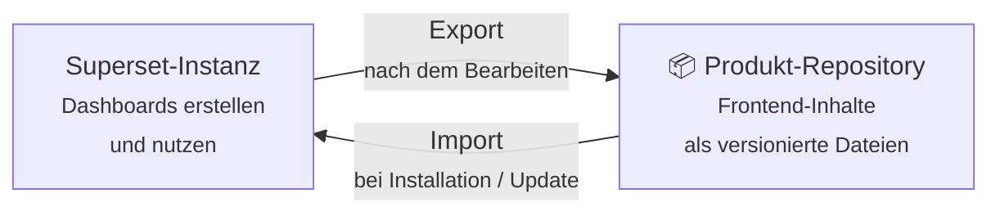

# Frontend-Inhalte (Superset)

Dashboards sind normalerweise der Teil von BI, der sich *nicht* versionieren lässt.
Sie existieren direkt in der Datenbank des jeweiligen Tools, werden manuell erstellt und bieten weder Diffs noch Rollbacks.

coasti behandelt sie anders: **Frontend-Inhalte sind Code**.

## Dashboards als Code

Die Frontend-Ebene eines coasti-Produkts ist die vollständige Menge der [Apache-Superset](https://superset.apache.org/)-Objekte, die das Produkt mitliefert:

- **Dashboards** — die Seiten, die Endnutzer öffnen
- **Charts** — die einzelnen Visualisierungen
- **Datasets** — die Verbindung zwischen Charts und den dbt-Berichtsmodellen
- unterstützende Objekte wie Datenbankverbindungen (als Templates)

All dies wird in Dateiform exportiert und im Git-Repository des Produkts versioniert – direkt neben den dbt-Modellen, auf denen es aufbaut.
Jede Dashboard-Änderung ist somit ein regulärer Commit: Er lässt sich reviewen, per Rollback rückgängig machen und genau wie jede andere Code-Änderung deployen.

## superset_io: die Brücke

Das Werkzeug dahinter ist [superset_io](https://github.com/coasti-org/superset_io). Es bewegt Frontend-Inhalte in beide Richtungen:

Die beiden Richtungen entsprechen den beiden Rollen rund um ein Produkt:

- **Produkt-Ersteller** entwickeln und verfeinern Dashboards direkt in der Superset-Oberfläche – dem optimalen Werkzeug für visuelle Aufgaben – und **exportieren** das Ergebnis anschließend in das Repository.
- **Produkt-Nutzer** kommen mit diesen Exporten hingegen nie in Berührung: Der Installer **importiert** die Frontend-Inhalte bei der Erstinstallation sowie bei jedem weiteren Update vollautomatisch in die jeweilige Superset-Instanz.

## Warum nicht einfach manuell konfigurieren?

Von Hand gebaute Dashboards funktionieren — bis zum zweiten Deployment.
Dann muss jeder Chart erneut von Hand gebaut werden, und die Kopien driften mit jeder künftigen Änderung auseinander.

Mit Frontend-Inhalten als Code gilt:

- **Eine Definition, viele Instanzen:** Die Dashboards werden bei jedem Kunden völlig identisch installiert.
- **Zentrale Updates:** Wird ein Dashboard einmalig optimiert, lässt es sich als Produkt-Update nahtlos an alle Instanzen ausliefern.
- **Transparente Historie:** Das Git-Log beantwortet präzise, wann sich was an einem Dashboard geändert hat – eine Frage, die Superset von Haus aus nicht beantworten kann.

## Der umgebende Superset-Stack

Zwei weitere Repositories unterstützen die Frontend-Ebene: 
[superset_docker](https://github.com/coasti-org/superset_docker) stellt Superset als produktionsreifen Docker-Stack bereit, während [superset_lucide_extension](https://github.com/coasti-org/superset_lucide_extension) Lucide-Icons ergänzt (diese werden künftig standardmäßig im Docker-Image enthalten sein).  
Der genaue Betrieb wird im Admin Guide beschrieben. Für das konzeptionelle Verständnis genügt an dieser Stelle: Jede Superset-Instanz, in die ein Produkt installiert wird, erhält die zugehörigen Frontend-Inhalte automatisch über superset_io.

## Nächste Schritte

- Zurück zum großen Bild: [Architektur](../architecture)
- Eigene Dashboards bauen und exportieren: [Inhalte erstellen](/getting-started/create-content)